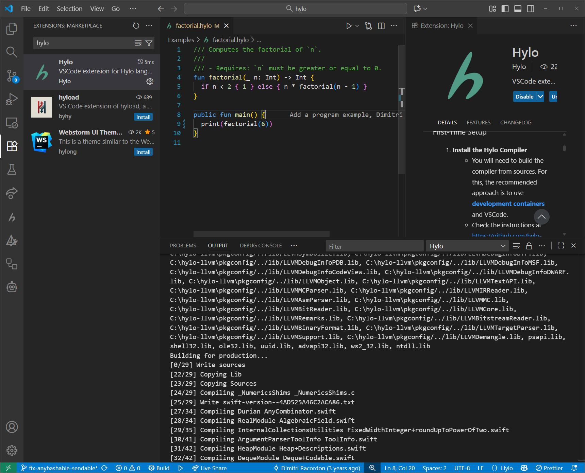

A language is much more enjoyable with some great editor support. At the moment, we have syntax highlighting for VSCode, Emacs and Neovim, and LSP integration in VSCode and Neovim. You can use
[Hylo's TextMate grammar](https://github.com/hylo-lang/vscode-hylo/blob/main/syntaxes/hylo.tmLanguage.json) and Hylo's [language server](https://github.com/hylo-lang/hylo-language-server) to add support for other editors.

import {slackLink} from "../../../../../links.js";
import {Aside} from "@astrojs/starlight/components";

<Aside title="Help wanted!">
    The language server is very much still work in progress. Contact us on <a href={slackLink}>Slack</a> if you want to join its development or help with integrating it to various editors!
</Aside>

## Visual Studio Code
Search for the extension named "Hylo" in the VSCode marketplace:


This extension also adds code execution support, so if you want to set that up, check out [its documentation](https://github.com/hylo-lang/vscode-hylo/). Note that the code execution feature currently only supports the old compiler, so you may want to disable the LSP which uses the new frontend.

## Neovim
Neovim has Hylo support via LSP. You can set it up using Mason and nvim-lspconfig. Here is a full minimal `init.lua` example with Hylo LSP support. This will automatically download and enable the Hylo language server from the Mason registry.

```lua init.lua ins={18-23} ins={38}
-- Bootstrap lazy.nvim
local lazypath = vim.fn.stdpath("data") .. "/lazy/lazy.nvim"
if not (vim.uv or vim.loop).fs_stat(lazypath) then
    local lazyrepo = "https://github.com/folke/lazy.nvim.git"
    local out = vim.fn.system({ "git", "clone", "--filter=blob:none", "--branch=stable", lazyrepo, lazypath })
    if vim.v.shell_error ~= 0 then
        vim.api.nvim_echo({
            { "Failed to clone lazy.nvim:\n", "ErrorMsg" },
            { out,                            "WarningMsg" },
            { "\nPress any key to exit..." },
        }, true, {})
        vim.fn.getchar()
        os.exit(1)
    end
end
vim.opt.rtp:prepend(lazypath)

-- Add file type detection for Hylo (for Neovim versions <= 0.11.5)
vim.filetype.add({
    extension = {
        hylo = "hylo",
    },
})

-- Setup plugins
require("lazy").setup({
    {
        "neovim/nvim-lspconfig",
        dependencies = {
            "williamboman/mason.nvim",
            "williamboman/mason-lspconfig.nvim",
        },
        config = function()
            require("mason").setup()
            require("mason-lspconfig").setup({
                ensure_installed = {
                    "lua_ls",
                    "hylo_ls", -- Install Hylo language server using Mason
                },
                automatic_enable = true
            })
        end
    }
})
```

See this article for more details on the development of the Neovim integration: [Add Neovim Support for Your Language](/blog/nvim-lsp).

## Emacs: Hylo mode
We have an Emacs mode for Hylo in [this repository](https://github.com/hylo-lang/hylo-mode), which provides basic syntax highlighting. It is a fork of Swift's Emacs mode, so expect (and report) some inconsistencies. LSP support is not yet integrated.

## Zed, IntelliJ, and Others...
You can use the [Hylo's TextMate grammar](https://github.com/hylo-lang/vscode-hylo/blob/main/syntaxes/hylo.tmLanguage.json) of Hylo to easily add syntax highlighting support to other editors. If you have created an extension, please let us know so that we can promote it here, and possibly move it to the [Hylo GitHub organization](https://github.com/hylo-lang/)!

