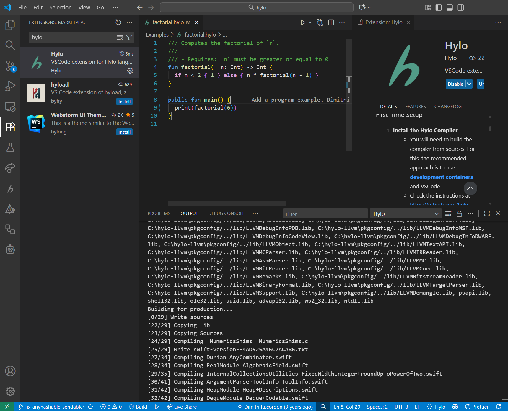

A language is much more enjoyable with great editor support. Although far from perfect, Hylo already has a language
server, and support for various editors:
- [VSCode](#visual-studio-code)
- [Neovim](#neovim)
- [Jetbrains IDEs](#jetbrains-ides-intellij-clion-etc)
- [Emacs](#emacs-hylo-mode)

<Aside title="Extending support">
    You can use Hylo's
    [TextMate grammar](https://github.com/hylo-lang/vscode-hylo/blob/main/syntaxes/hylo.tmLanguage.json) and
    [language server](https://github.com/hylo-lang/hylo-language-server) to add support for more editors. We would like
    to also maintain a tree-sitter grammar for incremental parsing.

    If you've created an extension, please let us know so that we can promote it here, and possibly move it to the
    [Hylo GitHub organization](https://github.com/hylo-lang/)!
</Aside>

import {Aside} from "@astrojs/starlight/components";

## Visual Studio Code
Search for the extension named "Hylo" in the marketplace (in [VS](https://marketplace.visualstudio.com/items?itemName=hylo-lang.hylo) or [Open VSX](https://open-vsx.org/extension/hylo-lang/hylo)):


The language server is automatically downloaded when you open a Hylo file.

## Neovim
Neovim has Hylo support via LSP. You can set it up using Mason and nvim-lspconfig. Here is a full minimal `init.lua` example with Hylo LSP support. This will automatically download and enable the Hylo language server from the Mason registry.

```lua init.lua ins={18-23} ins={38}
-- Bootstrap lazy.nvim
local lazypath = vim.fn.stdpath("data") .. "/lazy/lazy.nvim"
if not (vim.uv or vim.loop).fs_stat(lazypath) then
    local lazyrepo = "https://github.com/folke/lazy.nvim.git"
    local out = vim.fn.system({ "git", "clone", "--filter=blob:none", "--branch=stable", lazyrepo, lazypath })
    if vim.v.shell_error ~= 0 then
        vim.api.nvim_echo({
            { "Failed to clone lazy.nvim:\n", "ErrorMsg" },
            { out,                            "WarningMsg" },
            { "\nPress any key to exit..." },
        }, true, {})
        vim.fn.getchar()
        os.exit(1)
    end
end
vim.opt.rtp:prepend(lazypath)

-- Add file type detection for Hylo (for Neovim versions <= 0.11.5)
vim.filetype.add({
    extension = {
        hylo = "hylo",
    },
})

-- Setup plugins
require("lazy").setup({
    {
        "neovim/nvim-lspconfig",
        dependencies = {
            "williamboman/mason.nvim",
            "williamboman/mason-lspconfig.nvim",
        },
        config = function()
            require("mason").setup()
            require("mason-lspconfig").setup({
                ensure_installed = {
                    "lua_ls",
                    "hylo_ls", -- Install Hylo language server using Mason
                },
                automatic_enable = true
            })
        end
    }
})
```

See this article for more details on the development of the Neovim integration: [Add Neovim Support for Your Language](/blog/nvim-lsp).

## JetBrains IDEs (IntelliJ, CLion, etc.)
There is experimental support for JetBrains IDEs implemented in [jetbrains-hylo](https://github.com/hylo-lang/jetbrains-hylo).
There are a lot of rough edges that we need to fix still, as the JetBrains LSP support is not perfect out of the box.

## Emacs: Hylo mode
We have an Emacs mode for Hylo in [this repository](https://github.com/hylo-lang/hylo-mode), which provides basic syntax highlighting. It is a fork of Swift's Emacs mode, so there may still be some inconsistencies. LSP support is not yet integrated.
